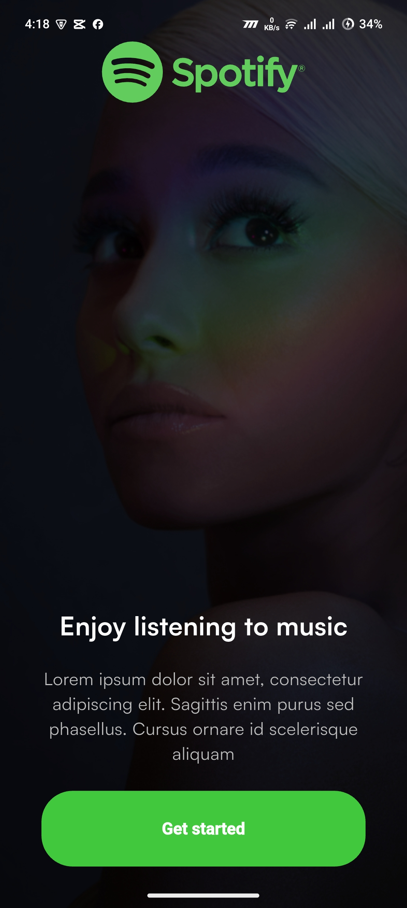
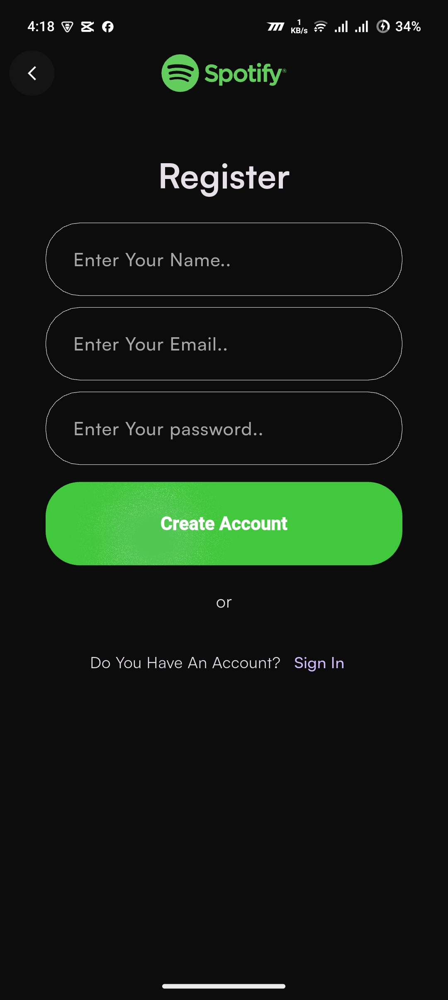
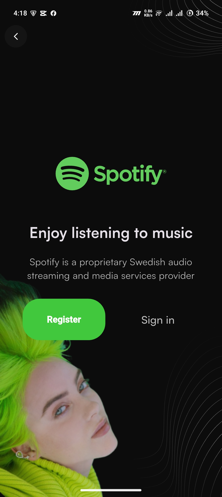
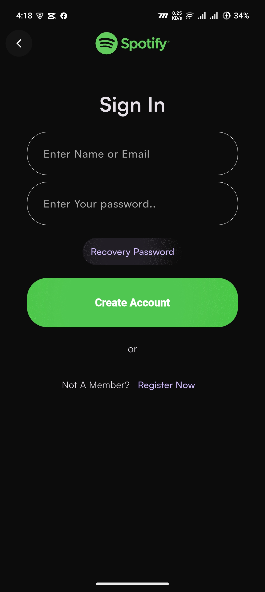
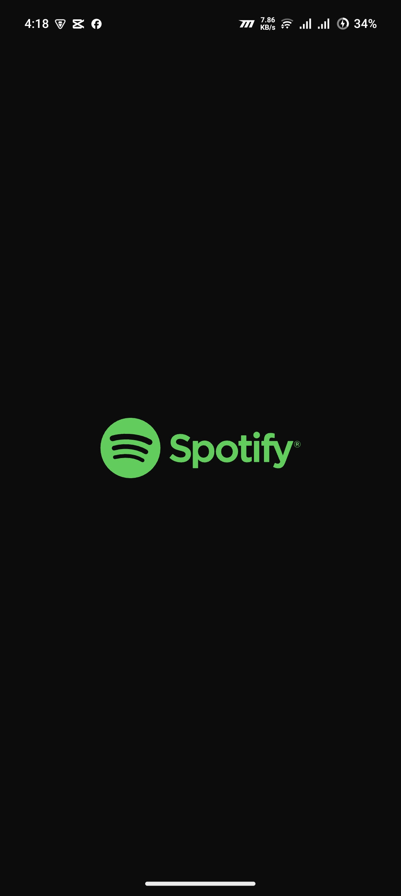

🎧 Spotify Clone (Flutter UI)

A modern Spotify Clone UI built with Flutter.
This project replicates the authentication and onboarding UI of Spotify with both Dark Mode and Light Mode designs.

The goal of this project is to practice Flutter UI development, responsive layouts, and clean design implementation.

✨ Features

🎵 Spotify Inspired UI Design

🌙 Dark Mode Interface

☀️ Light Mode Interface

🔐 Authentication Screens (Login & Register)

📱 Responsive Mobile UI

🎨 Clean and Modern Design

🛠 Tech Stack

Flutter

Dart

Material Design

📱 App Screenshots
🌙 Dark Mode

    
 
   

☀️ Light Mode

    
 
   

///Clone the repository

git clone https://github.com/raisul-dev/Spotify_Clone.git

Go to project directory

cd Spotify_Clone

Install dependencies

flutter pub get

Run the project

flutter run
🎯 Purpose of This Project

This project was built to practice:

Flutter UI Development

Mobile App Layout Design

Dark & Light Theme UI

Clean Flutter Code Structure

👨‍💻 Author

Raisul Islam

Flutter Developer
CSE Student at Dhaka International University

GitHub
https://github.com/raisul-dev

⭐ Support

If you like this project, please give it a star ⭐ on GitHub.
